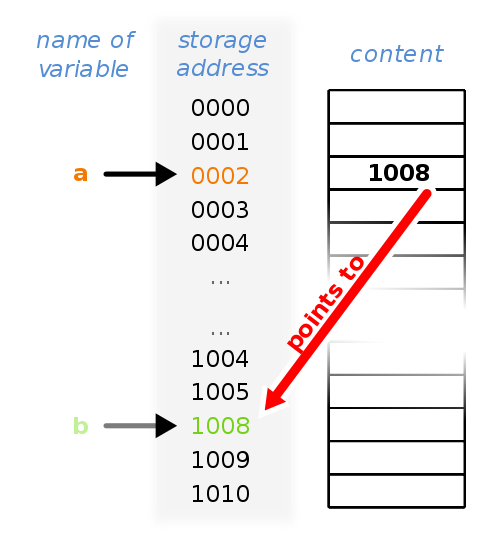

Pointers are a fundamental concept in C programming that allow variables to store memory addresses of other variables. This enables direct access and manipulation of memory, which is essential for efficient programming and advanced data structures.

#### Declaring and Using Pointers

A pointer is declared by placing an asterisk (\*) before its name. For example:

```
int *ptr;
```

This declares a pointer to an integer. You can assign the address of a variable to a pointer using the address-of operator (&):

```
int var = 5;
ptr = &var;
```

Now, `ptr` holds the address of `var`. To access the value stored at that address (dereferencing), use the asterisk:

```
printf("%d\n", *ptr); // prints 5
```

#### Pointers and Arrays

Arrays are closely related to pointers. The name of an array acts as a constant pointer to its first element. For example:

```
int arr[100];
```

Here, `arr` is equivalent to a pointer to the first element. Accessing `arr[3]` is the same as `*(arr + 3)`.

#### Dynamic Memory Allocation

Pointers are essential for dynamic memory allocation. Using the `malloc()` function from `stdlib.h`, you can allocate memory at runtime:

```
int *ptr = (int *)malloc(20 * sizeof(int));
```

This allocates space for 20 integers and stores the address in `ptr`.

#### Pointer Arithmetic

Pointers support arithmetic operations. Adding 1 to an integer pointer moves it to the next integer (skipping 4 bytes), while adding 1 to a char pointer moves it by 1 byte. This is useful for iterating through arrays and managing memory.

#### Applications of Pointers

Pointers allow functions to modify variables directly, enable the creation of dynamic data structures like linked lists, and are crucial for efficient memory management in C.



Arithmatical operations like addition and subtraction can be performed to a pointer. The nature of these arithmatic operations is what distinguishes an integer pointer from, say, a character pointer, which otherwise just store memory addresses for another variable. Adding one to an interger pointer makes to point to the next integer, and hence, it skips 4 bytes. Adding one to a character pointer makes it to point to the next character, and hence, it skips only 1 byte. Hence, for the array arr, writing arr[3] is equivalent to writing \*(arr+3). Both refer to the value stored in the 4th cell of the array.
